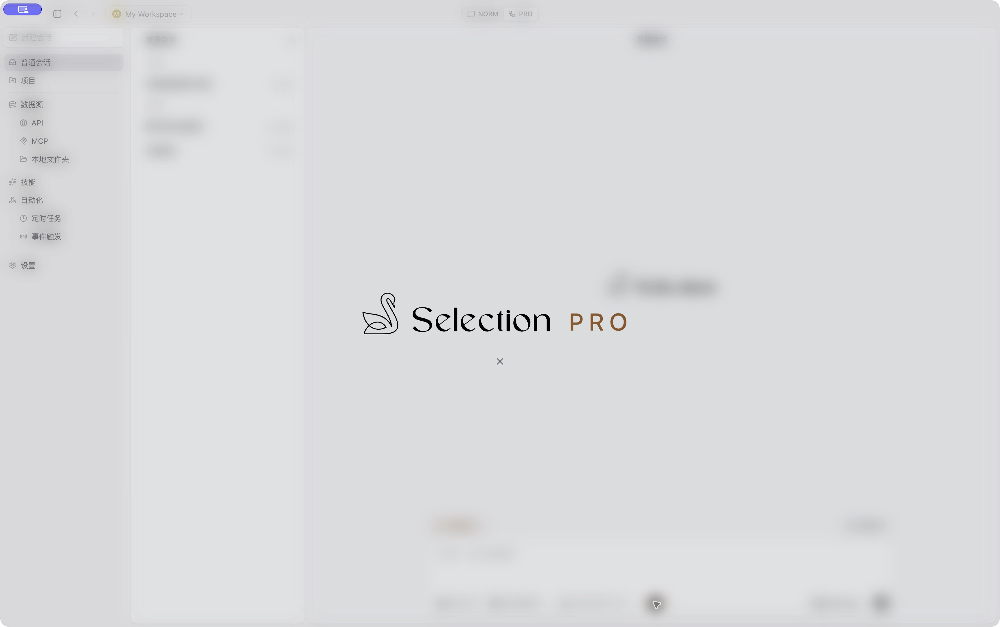
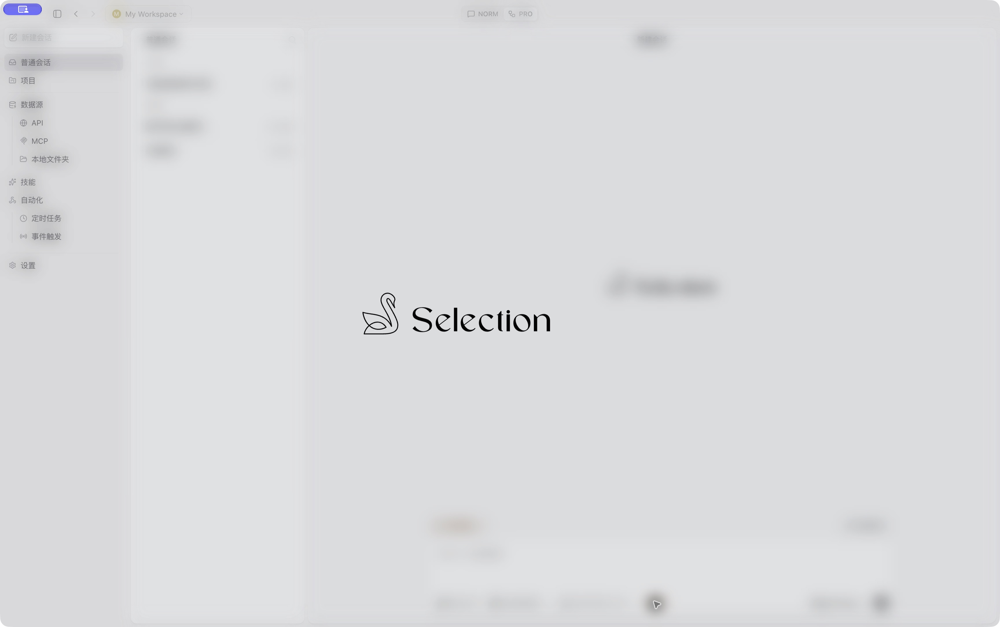
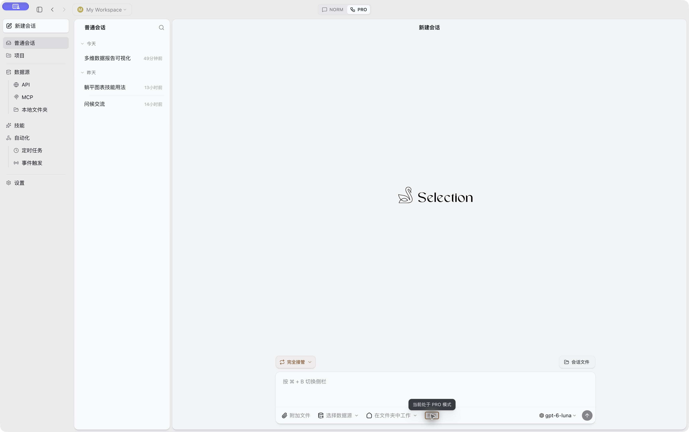

# PRO 铭牌三连击与品牌展示

日期：2026-10-05。本次基线：`45539dcba`，本地 `version-3.0`。

采用用户在动画对比页中选中的「墨色凝实」，正式展示使用 GSAP。保留天鹅与 Selection 资源、居中横排、PRO 字号和向下 3px 的视觉微调。PRO 整体由低透明度的中性色凝实为主题金色；字距与位置保持稳定，没有模糊、缩放、扫光或逐字动画。

## 呈现与时序

| 相对品牌内容挂载时间 | 呈现 |
| --- | --- |
| 0–0.64 秒 | 全窗口遮罩与 12px 柔焦进入；浅色遮罩黑色透明度 10%，深色 24%。 |
| 0.10–1.00 秒 | 天鹅与 Selection 用原有柔焦动画显现。 |
| 1.50–2.60 秒 | 品牌完成后停顿 0.5 秒，PRO 用 1.1 秒的 `sine.inOut` 曲线凝实。 |
| 3.60–3.80 秒 | PRO 完成后再等待 1 秒，下方关闭按钮用 200ms 淡入。 |
| 手动关闭 | 品牌与遮罩执行 240ms 渐隐，随后焦点返回铭牌。 |

关闭按钮在品牌组合正下方，间隔 32px，不推动组合位置。等待期间 `autoAlpha` 使按钮不可见、不可点击且无法获得键盘焦点；没有自动消失计时器。按钮、Esc 与空白处均可关闭。

颜色用 CSS `color-mix` 在 `--muted-foreground` 与 `--pro-accent` 之间混合，GSAP 只驱动混合比例和透明度，避免将 OKLCH 令牌交给 RGB 颜色解析器。浅色仍为铜金 `#8B5527`，深色仍为香槟金 `#D2AD76`；主题变化可直接影响颜色令牌。

减少动态效果时保留纯淡入路径：品牌用 150ms 显现，停顿 0.5 秒后 PRO 用 150ms 淡入，在 1.80 秒开始显示关闭按钮，用 150ms 淡入。退出为 150ms，不使用空间移动、柔焦或颜色过渡。

GSAP 与品牌内容通过 `React.lazy` 在打开后加载；本次生产构建对应独立块 gzip 28.68kB。`gsap.matchMedia` 管理减少动态效果并在卸载时还原动画。关闭时暂停入场时间线，保留当前画面直到 Radix 的退出动画结束，避免延迟按钮在关闭过程中继续出现。

## 验证

- 生产构建后重载实际 Electron 窗口，在 PRO 的空白新建页面验证，没有发送模型消息或修改会话权限。
- 鼠标三连击打开后约 1.05 秒，品牌已显示，PRO 和关闭按钮尚未出现；无障碍树没有关闭按钮，焦点位于展示容器。
- 约 5.77 秒截图确认 PRO 为实心铜金字面，关闭按钮位于组合正下方，展示持续保持打开。
- Tab 可聚焦显示后的关闭按钮，Enter 关闭后焦点返回铭牌。
- Enter 重新打开，在关闭按钮隐藏期间按 Tab 不会聚焦按钮；Esc 可提前退出，并恢复铭牌焦点。
- 全仓类型检查、修改文件 ESLint、Impeccable 机械检测、renderer 生产构建与 `git diff --check` 通过。
- 原有模式导航与新建品牌测试共 4 项、14 个断言通过。
- 此次实际窗口验证为浅色主题；未修改系统设置复测深色主题、减少动态效果或窄窗口。相应路径通过代码与类型检查，截图不作为这些路径的实测证据。

## 保留的铭牌交互

输入区铭牌禁用文字选择和双击默认行为；鼠标、触控在相邻点击间隔不超过 500ms 时，第三次点击打开品牌展示。键盘与辅助技术保持标准单次激活方式。Radix Dialog 负责焦点和背景交互隔离；提示内容在打开时卸载，避免抢先处理 Escape。

铭牌聚焦使用 1px 内部描边，保持单层轮廓。以下图片来自此前焦点样式修复的实际窗口，本次未修改该样式。

